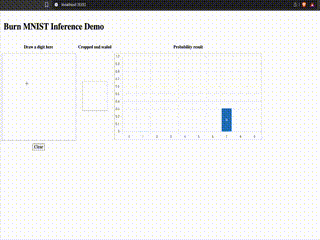

# Mnist inference web demo

The [burn mnist example](./burn_mnist) is copied from the [burn examples](https://github.com/tracel-ai/burn/tree/main/examples/mnist-inference-web) and we use ndarray for the backend by default.

We use xtask to build a small axum server to then serve the wasm, build with `wasm-pack`.

# Prerequisites

- [Rust installed](https://rust-lang.org/tools/install/)
- [wasm-pack installed]: `cargo install wasm-pack` (after you installed rust)

# Run it

In order to run it, run

```sh
cargo xtask serve <port>
# e.g.
cargo xtask serve 8080
```

If no port is given, it defaults to 3000.

# Result


